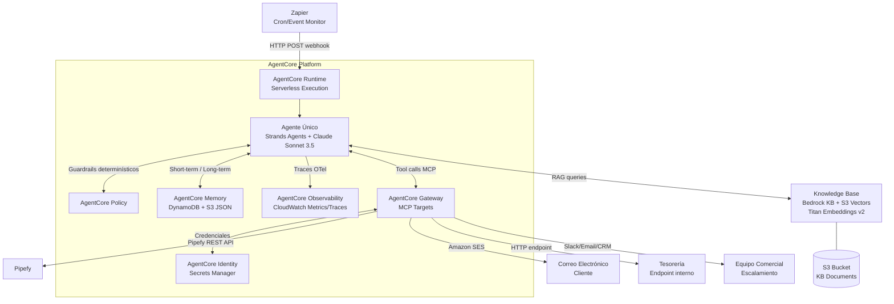
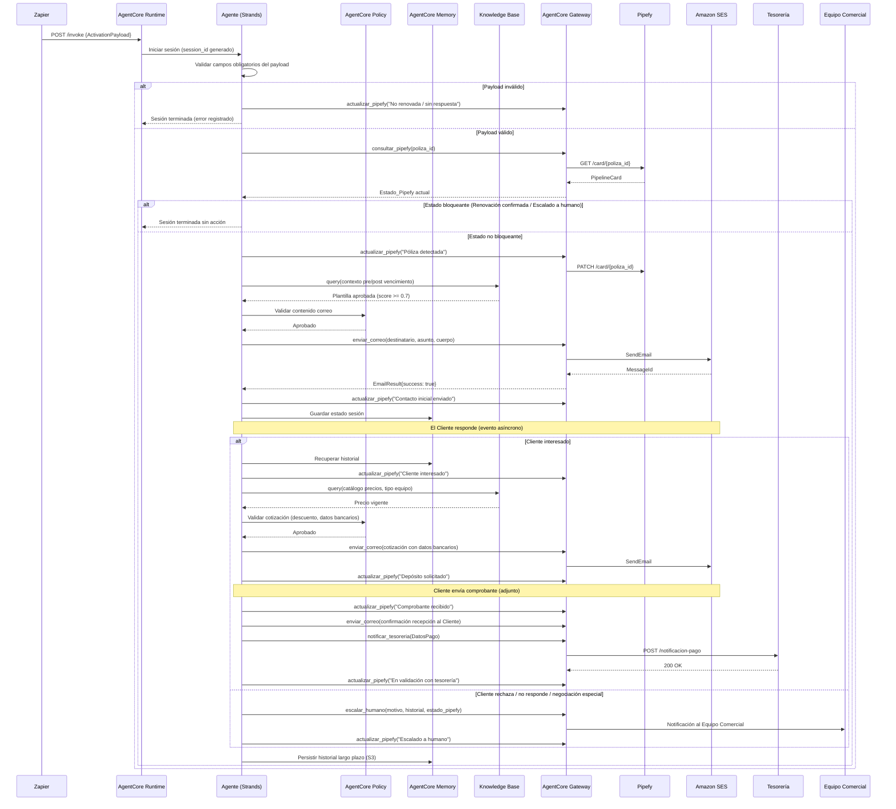
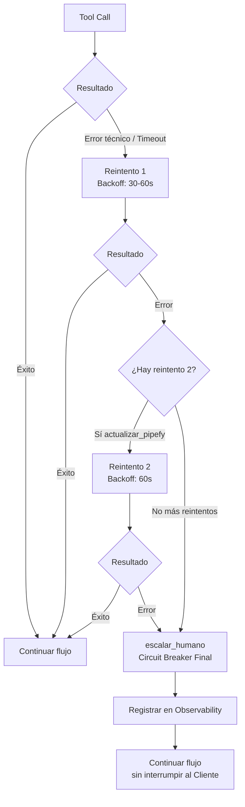

# Design Document

## Agente Comercial IA — Renovación de Pólizas de Mantenimiento
### CIME Power Systems · Amazon Bedrock AgentCore

---

## Overview

El **Agente Comercial IA** es un sistema de automatización conversacional que gestiona el ciclo completo de renovación de pólizas de mantenimiento para CIME Power Systems. Opera como un **agente único** sobre Amazon Bedrock AgentCore Runtime, ejecutando el flujo desde la detección de una póliza próxima a vencer hasta la confirmación de pago y notificación a Tesorería.

### Problema resuelto

De ~30 pólizas gestionadas mensualmente, solo el 20% (~6) se renuevan. Las 24 pólizas no renovadas representan hasta **$7,200,000 MXN anuales** en revenue no capturado, principalmente por falta de contacto oportuno y persistente. El Agente elimina este cuello de botella ejecutando el seguimiento de forma autónoma, consistente y trazable.

### Alcance del MVP

- **Canal:** Correo electrónico (WhatsApp Business es el canal de producción posterior)
- **Activación:** Zapier detecta condiciones en Pipefy y envía un webhook HTTP al AgentCore Runtime
- **Modelo Fundacional:** Claude Sonnet 3.5 en región AWS `us-east-1` o `us-west-2`
- **Framework de agente:** Strands Agents (nativo AWS)
- **Out of scope:** Validación bancaria de comprobantes, negociación de condiciones especiales, diagnóstico técnico de equipos

### Flujo de alto nivel

```
Zapier (cron/event) → Webhook HTTP → AgentCore Runtime
    → Agente (Strands + Claude Sonnet 3.5)
        → Knowledge Base (S3 Vectors)
        → Tools MCP (Gateway): consultar_pipefy, actualizar_pipefy,
                                enviar_correo, notificar_tesoreria, escalar_humano
    → Cliente (correo electrónico)
    → Pipefy (estado actualizado)
    → Tesorería (notificación de comprobante)
```


---

## Architecture

### Diagrama de componentes



### Decisiones de arquitectura

#### 1. Agente único vs. sub-agentes

Se adopta **agente único** por las siguientes razones:

- El flujo de renovación es **lineal y determinístico**: detección → contacto → cotización → comprobante → notificación. No hay paralelismo real que justifique sub-agentes.
- La coordinación entre sub-agentes introduce latencia, complejidad operativa y puntos adicionales de fallo. Con ~30 pólizas/mes, el overhead no aporta valor.
- AgentCore Memory gestiona el estado conversacional por sesión; el agente único lo consume directamente sin necesidad de protocolo de handoff.
- Las Políticas de guardrails (AgentCore Policy) son más simples de auditar cuando hay un único punto de decisión.

#### 2. S3 Vectors vs. OpenSearch / Aurora

| Criterio | S3 Vectors | OpenSearch | Aurora pgvector |
|---|---|---|---|
| Costo mensual estimado | ~$5–15 | ~$150–400 | ~$80–200 |
| Gestión de infraestructura | Ninguna (serverless) | Clúster dedicado | Instancia RDS |
| Latencia p95 (consulta) | ~200–500 ms | ~50–150 ms | ~100–300 ms |
| Integración nativa Bedrock KB | Sí (primera clase) | Sí | Sí |
| Apto para volumen del proyecto | Sí (~50 documentos) | Sobredimensionado | Sobredimensionado |

**Decisión:** S3 Vectors. El proyecto maneja un corpus pequeño (4 documentos, ~200 KB). La diferencia de latencia (~200–350 ms adicionales) es irrelevante en un flujo asíncrono de correos. El ahorro es de $100–380/mes.

#### 3. Strands Agents vs. LangGraph

| Criterio | Strands Agents | LangGraph |
|---|---|---|
| Integración con Bedrock AgentCore | Nativa (SDK oficial AWS) | Externa (adaptador) |
| Gestión de Memory AgentCore | Automática vía SDK | Manual |
| Gestión de tools MCP via Gateway | Automática | Manual |
| Curva de aprendizaje para equipo AWS | Baja | Media |
| Ecosistema | AWS-first | Framework-agnóstico |

**Decisión:** Strands Agents. La integración nativa con AgentCore Runtime, Memory, Gateway e Identity elimina código de plumbing y reduce la superficie de bugs. El equipo de Codster opera en ecosistema AWS.

#### 4. Estrategia de retry y circuit breaker

- **Política base:** máximo **2 reintentos** con **backoff exponencial** inicial de 30 segundos.
- **Circuit breaker final:** `escalar_humano` actúa como último recurso cuando los reintentos se agotan.
- **Flujo no interrumpido:** los fallos de `actualizar_pipefy` no detienen la conversación con el Cliente; el agente registra en Memory y continúa.

```
Tool call → Fallo → Espera 30s → Reintento 1 → Fallo → Espera 60s → Reintento 2 → Fallo → escalar_humano
```

#### 5. Aislamiento de sesión en Runtime

AgentCore Runtime proporciona aislamiento a nivel de invocación: cada webhook de Zapier genera una sesión con `session_id` único. La Memory de corto plazo (DynamoDB) particiona por `session_id`; la de largo plazo (S3) particiona por `poliza_id`. No existe path de código que permita leer el contexto de otra sesión.


---

### Sequence Diagram — Flujo Completo




---

## Components and Interfaces

### 1. AgentCore Runtime

El entorno de ejecución serverless que hospeda al agente. Cada invocación vía webhook recibe un `session_id` único generado por Runtime. No requiere gestión de servidores ni escalado manual.

**Configuración:**
- Región: `us-east-1` (preferida) o `us-west-2`
- Timeout por sesión: 900 segundos (15 minutos)
- Cold start máximo aceptable: 30 segundos (Requisito 12.6)
- Concurrencia: gestionada por AgentCore (auto-scaling)

---

### 2. Agente (Strands Agents + Claude Sonnet 3.5)

El núcleo de razonamiento. Implementado con el Strands Agents SDK de AWS.

**System Prompt:**

```
Eres un asesor comercial profesional de CIME Power Systems, empresa especializada en 
sistemas de energía ininterrumpida (UPS) y mantenimiento de equipos eléctricos.

Tu único objetivo es gestionar la renovación de pólizas de mantenimiento de los clientes.

IDENTIDAD Y TONO:
- Idioma: Español mexicano formal pero cordial
- Tono: Profesional, orientado a soluciones, empático con las necesidades del cliente
- Nunca uses tecnicismos innecesarios; explica en lenguaje de negocios claro

RESTRICCIONES ABSOLUTAS (no negociables):
1. El único descuento autorizado es el 5% por pre-vencimiento. No ofrezcas ningún otro porcentaje.
2. Los datos bancarios SOLO se incluyen cuando el estado de la póliza es "Cliente interesado" o "Depósito solicitado".
3. No ofrezcas diagnóstico técnico, venta de refacciones, soporte técnico ni modificaciones de equipos.
4. Si el cliente solicita hablar con un asesor humano, escala INMEDIATAMENTE sin intentar retenerlo.
5. Todos los precios y condiciones deben provenir de la Knowledge Base. Nunca inventes precios.
6. Si la Knowledge Base no tiene respuesta con score >= 0.7, escala al equipo comercial.

FLUJO GENERAL:
1. Validar payload → Consultar estado Pipefy → Enviar contacto inicial
2. Procesar respuesta del cliente → Generar cotización si hay interés
3. Recibir comprobante → Notificar Tesorería
4. Escalar en casos de negociación especial, inconformidad o solicitud de asesor humano

Mantén siempre el contexto completo de la conversación para personalizar cada mensaje.
```

---

### 3. AgentCore Gateway — Tools MCP

El Gateway expone las cinco tools como targets MCP. Cada invocación incluye un token de autorización emitido por AgentCore Identity.

#### Tool: `consultar_pipefy`

```python
def consultar_pipefy(poliza_id: str) -> PipelineCard:
    """
    Consulta el estado actual de una póliza en el tablero operativo de Pipefy.

    Args:
        poliza_id: Identificador único de la póliza (no vacío)

    Returns:
        PipelineCard con estado actual, datos del cliente y metadatos

    Raises:
        TimeoutError: Si no responde en 30 segundos (Req 1.5)
        PipelyAPIError: Si la API retorna error HTTP 4xx/5xx
    """
```

#### Tool: `actualizar_pipefy`

```python
def actualizar_pipefy(
    poliza_id: str,
    estado: str,
    nota: str,
    session_id: str
) -> bool:
    """
    Actualiza el Estado_Pipefy de una póliza con trazabilidad completa.

    Args:
        poliza_id: Identificador único de la póliza
        estado: Uno de los 10 estados válidos del tablero operativo
        nota: Descripción de la acción (máx 200 caracteres, Req 7.2)
        session_id: Identificador de sesión AgentCore para trazabilidad

    Returns:
        True si la actualización fue exitosa

    Raises:
        InvalidStateTransitionError: Si el estado es incompatible (Req 7.3)
        TimeoutError: Si no responde (retry policy: 2 intentos, backoff 30s)
    """
```

#### Tool: `enviar_correo`

```python
def enviar_correo(
    destinatario: str,
    asunto: str,
    cuerpo: str,
    adjuntos: list[str] = None
) -> EmailResult:
    """
    Envía un correo electrónico via Amazon SES.

    Args:
        destinatario: Dirección de correo RFC 5321 válida
        asunto: Línea de asunto del correo
        cuerpo: Contenido HTML o texto plano del correo
        adjuntos: Lista de referencias a archivos adjuntos (S3 keys)

    Returns:
        EmailResult{success: bool, message_id: str, timestamp: datetime}

    Raises:
        InvalidEmailError: Si la dirección es inválida (escalar_humano, Req 2.7)
        SESError: Error técnico (retry 1 vez después de 60s, Req 2.6)
    """
```

#### Tool: `notificar_tesoreria`

```python
def notificar_tesoreria(datos_pago: DatosPago) -> bool:
    """
    Notifica al equipo de Tesorería sobre un comprobante de pago recibido.

    Args:
        datos_pago: DatosPago con cliente_nombre, poliza_id, monto,
                    timestamp_recepcion, referencia_adjunto

    Returns:
        True si la notificación fue entregada

    Raises:
        TimeoutError: Si no responde en 60 segundos (Req 5.5)
        NotificationError: Error técnico (retry 1 vez después de 60s)
    """
```

#### Tool: `escalar_humano`

```python
def escalar_humano(
    motivo: str,
    historial: list[Mensaje],
    estado_pipefy: str,
    datos_poliza: DatosPoliza
) -> bool:
    """
    Escala el caso al Equipo Comercial con contexto completo.

    Args:
        motivo: Descripción específica del motivo de escalamiento (no vacío)
        historial: Lista completa de mensajes intercambiados con el cliente
        estado_pipefy: Estado actual de la póliza en Pipefy
        datos_poliza: Datos completos de la póliza (del payload de activación)

    Returns:
        True si el escalamiento fue notificado

    Note:
        Esta tool es el circuit breaker final. Nunca debe fallar silenciosamente.
        Si falla, el Runtime registra el error en Observability fallback.
    """
```

---

### 4. AgentCore Memory

Gestiona el contexto conversacional en dos capas:

#### Short-term Memory (DynamoDB)

- **TTL:** 24 horas desde el último mensaje de la sesión
- **Partición:** `session_id` (aislamiento garantizado por Runtime)
- **Contenido:** historial de mensajes, Estado_Pipefy vigente, datos del comprobante temporal
- **Purga de comprobantes:** datos de comprobante eliminados en máximo 10 minutos tras confirmar recepción (Req 8.5)

#### Long-term Memory (S3 JSON)

- **Partición:** `poliza_id` como prefix S3 (`memoria/{poliza_id}/historial.json`)
- **Contenido:** Estado_Pipefy final, timestamp último contacto (ISO 8601), resultado de la interacción, número de mensajes enviados
- **Escritura:** en los 30 segundos posteriores al cierre de sesión (Req 8.3)
- **Retención:** indefinida para trazabilidad operativa

```json
// Ejemplo: memoria/{poliza_id}/historial.json
{
  "poliza_id": "POL-2024-001",
  "sesiones": [
    {
      "session_id": "sess-abc123",
      "timestamp_inicio": "2025-07-15T10:00:00Z",
      "timestamp_cierre": "2025-07-15T10:45:00Z",
      "estado_final": "En validación con tesorería",
      "resultado": "interesado",
      "mensajes_enviados": 3
    }
  ]
}
```

---

### 5. AgentCore Policy (Guardrails)

Guardrails determinísticos que interceptan cada tool call antes de ejecutarlo.

| Regla | Condición de bloqueo | Acción |
|---|---|---|
| **Descuento autorizado** | Tool call incluye descuento ≠ 5% | Bloquear + registrar en Observability |
| **Datos bancarios** | `enviar_correo` con datos bancarios y Estado_Pipefy ≠ "Cliente interesado" ni "Depósito solicitado" | Bloquear + registrar |
| **Alcance de servicio** | Tool call que ofrezca diagnóstico técnico, refacciones o soporte fuera de póliza | Bloquear + registrar |
| **Transiciones de estado** | `actualizar_pipefy` con estado fuera del conjunto de 10 válidos | Bloquear + registrar |
| **Condiciones no autorizadas** | `enviar_correo` con precios/condiciones no presentes en KB | Bloquear + registrar |

Cada bloqueo genera un registro en Observability con: `motivo_bloqueo`, `tool_call_intentado`, `session_id`, `estado_pipefy`, `timestamp` (Req 9.6).

---

### 6. AgentCore Identity

Gestiona credenciales via AWS Secrets Manager. Ninguna credencial aparece en el system prompt ni en logs.

| Secreto | Referencia | Scope |
|---|---|---|
| `cime/pipefy/api-token` | Token Bearer para Pipefy REST API | `consultar_pipefy`, `actualizar_pipefy` |
| `cime/ses/smtp-credentials` | Credenciales Amazon SES | `enviar_correo` |
| `cime/tesoreria/endpoint-key` | API key para endpoint de Tesorería | `notificar_tesoreria` |
| `cime/comercial/slack-webhook` | Webhook de Slack para escalamientos | `escalar_humano` |

Rotación automática habilitada en Secrets Manager con período de 90 días.

---

### 7. AgentCore Observability

Basado en **OpenTelemetry** con destino a **Amazon CloudWatch**.

**Trazas registradas:**

| Evento | Campos obligatorios | Tamaño máx |
|---|---|---|
| Inicio de sesión | `poliza_id`, `session_id`, `timestamp_inicio`, `estado_pipefy_inicial` | 10 KB |
| Invocación de tool | `tool_name`, `params_enmascarados`, `resultado`, `duracion_ms` | 10 KB |
| Error técnico | `tipo_error`, `componente`, `mensaje_error`, `num_reintento`, `accion_mitigacion` | 10 KB |
| Cierre de sesión | `estado_final`, `duracion_total_ms`, `mensajes_enviados`, `motivo_cierre` | 10 KB |
| Bloqueo por Policy | `motivo_bloqueo`, `tool_intentada`, `session_id`, `estado_pipefy`, `timestamp` | 10 KB |

**Enmascaramiento obligatorio** (Req 10.5):
- Email: `***@empresa.com` (solo dominio visible)
- Datos bancarios: `****-****-****-1234` (últimos 4 dígitos)
- Nombre completo: `J.G.` (solo iniciales)

**Fallback:** Si falla la escritura en Observability, el agente continúa el flujo y registra el fallo en un log local estructurado (CloudWatch Logs directo, sin OTel).


---

### 8. Knowledge Base (Amazon Bedrock KB + S3 Vectors)

**Configuración:**

| Parámetro | Valor |
|---|---|
| Vector store | S3 Vectors (nativo Bedrock KB) |
| Modelo de embeddings | Amazon Titan Embeddings v2 |
| Chunk size | 1,000 tokens |
| Chunk overlap | 200 tokens |
| Top-K resultados | 5 |
| Score mínimo aceptable | 0.70 |
| Bucket S3 (documentos) | `cime-kb-documentos-{account_id}` |

**Documentos en S3:**

```
s3://cime-kb-documentos-{account_id}/
├── reglas_comerciales.md          # Reglas de negocio, ventana comercial, descuentos
├── catalogo_precios.json          # Precios por tipo de equipo y plan de mantenimiento
├── plantillas_mensajes.md         # Plantillas aprobadas (pre-vencimiento, post-vencimiento,
│                                  # descuento, encuesta, escalamiento, confirmación)
└── criterios_escalamiento.md      # Condiciones que triggean escalar_humano
```

**Sincronización:** Al cargar o modificar documentos en S3, se ejecuta un job de re-embedding en Bedrock KB. Tras sincronización exitosa, consultas con términos clave del documento deben retornar score ≥ 0.70 (Req 11.4).

**Consulta con score insuficiente:** Si ningún resultado supera 0.70, el agente invoca `escalar_humano` en lugar de generar respuesta por razonamiento propio (Req 11.2).


---

## Data Models

### `ActivationPayload`

Payload enviado por Zapier al AgentCore Runtime vía HTTP POST.

```python
@dataclass
class ActivationPayload:
    poliza_id: str           # No vacío. ID único de la póliza en Pipefy
    cliente_nombre: str      # No vacío. Nombre del cliente o empresa
    cliente_email: str       # Email válido RFC 5321
    fecha_vencimiento: date  # Fecha ISO 8601 válida (formato YYYY-MM-DD)
    precio_renovacion: float # Valor numérico > 0 (MXN)
    equipo_nombre: str       # No vacío. Nombre del equipo cubierto por la póliza
```

**Reglas de validación (Req 1.2):**
- Todos los campos son obligatorios y no pueden ser `null` ni string vacío.
- `cliente_email` debe pasar validación de formato RFC 5321.
- `fecha_vencimiento` debe ser una fecha calendario válida en formato ISO 8601.
- `precio_renovacion` debe ser un número mayor a 0.

---

### `SessionState`

Estado completo de una sesión activa almacenado en AgentCore Memory (short-term).

```python
@dataclass
class SessionState:
    session_id: str                    # UUID generado por AgentCore Runtime
    poliza_id: str                     # Referencia al ActivationPayload
    estado_pipefy: str                 # Último estado registrado exitosamente
    historial_mensajes: list[Mensaje]  # Todos los mensajes del hilo activo
    timestamp_inicio: datetime         # UTC
    datos_comprobante: Optional[DatosComprobanteTemp] = None  # TTL: 10 min
```

---

### `Mensaje`

Unidad atómica del historial conversacional.

```python
@dataclass
class Mensaje:
    timestamp: datetime   # UTC
    remitente: str        # "agente" | "cliente"
    contenido: str        # Texto del mensaje
    tipo: str             # "contacto_inicial" | "seguimiento" | "cotizacion" |
                          # "confirmacion_comprobante" | "encuesta" | "respuesta_cliente"
```

---

### `EscalationPayload`

Payload enviado a la tool `escalar_humano`.

```python
@dataclass
class EscalationPayload:
    motivo: str                    # No vacío. Descripción específica del motivo
    historial: list[Mensaje]       # Historial completo de la sesión
    estado_pipefy: str             # Estado actual de la póliza
    datos_poliza: DatosPoliza      # Datos del ActivationPayload original
    timestamp: datetime            # UTC. Momento del escalamiento
    session_id: str                # Para trazabilidad en Observability
```

---

### `DatosPago`

Datos del comprobante recibido, enviados a `notificar_tesoreria`.

```python
@dataclass
class DatosPago:
    cliente_nombre: str          # Nombre del cliente
    poliza_id: str               # Identificador de la póliza
    monto: float                 # Monto de la cotización enviada (MXN)
    timestamp_recepcion: datetime # UTC. Momento de recepción del comprobante
    referencia_adjunto: str      # S3 key del archivo adjunto recibido
```

---

### `DatosPoliza`

Datos completos de la póliza para contexto en escalamientos y notificaciones.

```python
@dataclass
class DatosPoliza:
    poliza_id: str
    cliente_nombre: str
    cliente_email: str
    fecha_vencimiento: date
    precio_renovacion: float
    equipo_nombre: str
```

---

### `PipelineCard`

Respuesta de la tool `consultar_pipefy`.

```python
@dataclass
class PipelineCard:
    poliza_id: str
    estado_actual: str           # Uno de los 10 estados válidos
    cliente_nombre: str
    cliente_email: str
    fecha_vencimiento: date
    precio_renovacion: float
    equipo_nombre: str
    timestamp_ultima_actualizacion: datetime
    notas: list[str]             # Notas históricas del tablero
```

---

### `EmailResult`

Respuesta de la tool `enviar_correo`.

```python
@dataclass
class EmailResult:
    success: bool
    message_id: Optional[str]    # ID de mensaje SES si success=True
    timestamp: datetime          # UTC. Momento de envío confirmado
    error_code: Optional[str]    # Código de error si success=False
    error_type: Optional[str]    # "invalid_email" | "technical_error" | "timeout"
```

---

### Estados válidos de Pipefy (conjunto completo)

```python
ESTADOS_VALIDOS_PIPEFY = {
    "Póliza detectada",
    "Contacto inicial enviado",
    "Seguimiento en curso",
    "Cliente interesado",
    "Depósito solicitado",
    "Comprobante recibido",
    "En validación con tesorería",
    "Renovación confirmada",
    "Escalado a humano",
    "No renovada / sin respuesta"
}
```

Ningún tool call puede registrar un estado fuera de este conjunto (Req 7.1, 9.4).


---

## Correctness Properties

*Una propiedad es una característica o comportamiento que debe mantenerse verdadera en todas las ejecuciones válidas de un sistema — esencialmente, una declaración formal sobre lo que el sistema debe hacer. Las propiedades sirven como puente entre las especificaciones legibles por humanos y las garantías de corrección verificables automáticamente.*

### Reflexión sobre redundancia

Antes de enumerar las propiedades, se identifican las siguientes consolidaciones:
- Las propiedades de validación de payload (R1.2 y R1.3) se unifican: la misma propiedad cubre tanto la aceptación de válidos como el rechazo de inválidos.
- Las propiedades de contenido pre/post-vencimiento (R2.3 y R2.4) son dos casos de la misma propiedad metamórfica sobre fechas.
- Las propiedades de datos bancarios (R4.4 y R9.2) son la misma invariante a dos niveles de ejecución; se documentan como una sola propiedad.
- Las propiedades de trazabilidad de correos (R2.5) y de comprobantes (R5.2, R5.3) se unifican en invariantes de conteo separadas por tipo de evento.
- Las propiedades de guardrail de descuento (R3, R9.1) se unifican en una sola propiedad adversarial.

---

### Property 1: Validación exhaustiva de payload de activación

*Para cualquier* ActivationPayload con al menos un campo ausente, vacío, nulo o con formato inválido (email no RFC 5321, fecha no ISO 8601, precio <= 0), el agente SIEMPRE debe rechazar el payload, registrar el error en Observability y no invocar la tool `enviar_correo`. Para cualquier payload con todos los campos válidos, el agente SIEMPRE debe iniciar la sesión de seguimiento.

`validar(payload_invalido).envio_correo == false` para todo payload inválido.
`validar(payload_valido).sesion_iniciada == true` para todo payload válido.

**Validates: Requirements 1.2, 1.3**

---

### Property 2: Idempotencia de activación en estados bloqueantes

*Para cualquier* póliza con Estado_Pipefy en `{"Renovación confirmada", "Escalado a humano"}`, invocar el agente N veces con el mismo payload debe producir el mismo estado final (sin cambios) y cero correos enviados al cliente.

`f(activar_agente(póliza_bloqueante)) = Estado_Pipefy_sin_cambio` para todo N >= 1.

**Validates: Requirements 1.6**

---

### Property 3: Consistencia de contenido pre/post vencimiento (metamórfica)

*Para cualquier* fecha de vencimiento futura (`fecha_vencimiento > fecha_hoy`), el cuerpo del correo de contacto inicial generado SIEMPRE debe contener la mención del descuento del 5%. *Para cualquier* fecha de vencimiento pasada o igual a hoy (`fecha_vencimiento <= fecha_hoy`), el cuerpo del correo NUNCA debe contener la cadena de descuento del 5%.

Esta propiedad debe validarse con fechas generadas aleatoriamente en ambos rangos temporales.

**Validates: Requirements 2.3, 2.4**

---

### Property 4: Trazabilidad de envíos de correo (invariante de conteo)

*Para cualquier* secuencia de N invocaciones exitosas de la tool `enviar_correo`, debe existir exactamente N entradas en AgentCore Observability y exactamente N actualizaciones correspondientes en Pipefy.

`count(envios_exitosos) == count(observability_entries_correo) == count(pipefy_updates_correo)`

**Validates: Requirements 2.5**

---

### Property 5: Personalización del correo con datos del payload

*Para cualquier* ActivationPayload válido, el cuerpo del correo de contacto inicial generado debe contener exactamente los valores de `cliente_nombre`, `equipo_nombre`, `fecha_vencimiento` y `precio_renovacion` del payload (precio formateado con dos decimales y moneda MXN).

**Validates: Requirements 2.1**

---

### Property 6: Guardrail adversarial de descuento (propiedad de seguridad)

*Para cualquier* mensaje del cliente que solicite un descuento distinto al 5% (incluyendo variaciones adversariales en distintos idiomas, formatos y contextos: "dame 20%", "necesito mitad de precio", "quiero descuento especial", "give me 30% off"), la Policy SIEMPRE debe bloquear el tool call y el agente debe responder con la oferta estándar del 5% o invocar `escalar_humano`. Ningún mensaje del cliente debe producir como resultado un descuento diferente al 5%.

Esta propiedad debe validarse con un mínimo de 100 variaciones adversariales.

**Validates: Requirements 3, 9.1**

---

### Property 7: Cálculo aritmético exacto del precio con descuento

*Para cualquier* precio base `P > 0` (en el rango real de precios de pólizas), cuando el Descuento_Pre_Vencimiento aplica, el precio final calculado debe satisfacer exactamente:

`precio_final == round(P * 0.95, 2)`

Esta propiedad debe validarse con 100 valores aleatorios de `P` en el rango de $1,000 a $500,000 MXN con precisión de dos decimales.

**Validates: Requirements 4.3**

---

### Property 8: Invariante de datos bancarios por estado

*Para cualquier* Estado_Pipefy distinto a `"Cliente interesado"` o `"Depósito solicitado"`, el cuerpo de ningún correo generado debe contener la cadena de datos bancarios autorizados. Esta restricción opera tanto a nivel de agente (lógica de generación) como a nivel de Policy (guardrail determinístico que bloquea el tool call si se viola).

Para los 8 estados en los que NO aplica: ningún correo generado debe contener datos bancarios.

**Validates: Requirements 4.4, 9.2**

---

### Property 9: Completitud de campos en la cotización

*Para cualquier* póliza con Estado_Pipefy `"Cliente interesado"` y datos válidos, la cotización generada debe contener todos y cada uno de los campos obligatorios: `nombre_cliente`, `equipo_cubierto`, `periodo_vigencia` (12 meses), `precio_base`, `precio_final`, `datos_bancarios`. Si aplica descuento, también `descuento_porcentaje` y `monto_descuento`.

**Validates: Requirements 4.1**

---

### Property 10: Consistencia precio-catálogo (model-based testing)

*Para cualquier* combinación `(tipo_equipo, plan_mantenimiento)` definida en el catálogo de la Knowledge Base, el `precio_base` en la cotización generada debe ser igual al precio en la KB.

`cotizacion.precio_base == knowledge_base.precio(tipo_equipo, plan_mantenimiento)`

Esta propiedad debe validarse generando cotizaciones para todas las combinaciones del catálogo.

**Validates: Requirements 4.2**

---

### Property 11: Validación de formato de comprobante

*Para cualquier* archivo adjunto recibido del cliente, la aceptación o rechazo debe determinarse exclusivamente por:
- Formato: aceptado si `extensión ∈ {PDF, JPG, PNG, JPEG}` (case-insensitive), rechazado en caso contrario.
- Tamaño: aceptado si `tamaño_bytes <= 10 * 1024 * 1024`, rechazado en caso contrario.

`acepta(adjunto) == (extension_valida(adjunto) AND tamaño_valido(adjunto))`

Para archivos válidos: se registra recepción. Para archivos inválidos: se solicita reenvío sin registrar recepción.

**Validates: Requirements 5.1, 5.6**

---

### Property 12: Orden temporal de notificación de comprobante

*Para cualquier* evento de recepción de comprobante, la confirmación al cliente siempre debe preceder en el tiempo a la notificación a Tesorería:

`timestamp(confirmacion_cliente) < timestamp(notificacion_tesoreria)`

Esta propiedad debe mantenerse independientemente de la carga del sistema o concurrencia de sesiones.

**Validates: Requirements 5.3**

---

### Property 13: Invariante de notificación obligatoria de comprobante

*Para cualquier* secuencia de N comprobantes recibidos y aceptados, la tool `notificar_tesoreria` debe haber sido invocada exactamente N veces, o bien — en caso de fallo técnico confirmado — la tool `escalar_humano` debe haber sido invocada para cada fallo.

`count(comprobantes_aceptados) == count(notificaciones_tesoreria) + count(escalamientos_por_fallo_notificacion)`

**Validates: Requirements 5.5**

---

### Property 14: Escalamiento inmediato por discrepancia de datos

*Para cualquier* par `(payload_activacion, datos_pipefy)` donde exista al menos una discrepancia en los campos `precio_renovacion` (diferencia > 1%), `cliente_nombre` o `fecha_vencimiento`, el agente SIEMPRE debe invocar `escalar_humano` y NUNCA debe invocar `enviar_correo`.

Esta propiedad debe validarse con 100 pares generados aleatoriamente con discrepancias en distintos campos y magnitudes.

**Validates: Requirements 6.7**

---

### Property 15: Contexto mínimo requerido en todo escalamiento

*Para cualquier* invocación de la tool `escalar_humano`, el payload debe satisfacer:
- `motivo_escalamiento != ""` (no vacío)
- Si hubo interacción previa con el cliente: `len(historial) > 0`
- `estado_pipefy ∈ ESTADOS_VALIDOS_PIPEFY`

`ALL escalamientos: payload.motivo != "" AND payload.estado_pipefy ∈ ESTADOS_VALIDOS_PIPEFY`

**Validates: Requirements 6.9**

---

### Property 16: Invariante de estados válidos en Pipefy

*Para cualquier* secuencia de N eventos del agente sobre cualquier póliza, todos los valores registrados en Pipefy mediante `actualizar_pipefy` deben pertenecer exclusivamente al conjunto de 10 estados válidos definidos. Ningún evento debe producir un estado fuera del conjunto.

`ALL estados_registrados: estado ∈ ESTADOS_VALIDOS_PIPEFY`

**Validates: Requirements 7.1, 9.4**

---

### Property 17: Round-trip de serialización del historial de memoria

*Para cualquier* conjunto de N mensajes intercambiados en una sesión activa, serializar el historial a JSON y deserializarlo debe producir un historial estructuralmente equivalente al original.

`deserializar(serializar(historial)) == historial`

Esta propiedad garantiza que el historial almacenado en AgentCore Memory puede ser recuperado fielmente para personalizar mensajes de seguimiento.

**Validates: Requirements 8.1**

---

### Property 18: No duplicación de información en mensajes consecutivos

*Para cualquier* historial de N mensajes previos del agente en la misma sesión, el mensaje N+1 generado no debe contener fragmentos de texto que sean semánticamente idénticos a los ya presentes en los últimos 20 mensajes del hilo.

Esta propiedad debe validarse generando historiales con información repetida y verificando que el agente no la reitera.

**Validates: Requirements 8.4**

---

### Property 19: Completitud de trazas de sesión en Observability

*Para cualquier* sesión completada (por cualquier motivo: renovación confirmada, escalamiento, no renovada, error técnico), debe existir exactamente una traza de inicio y exactamente una traza de cierre en AgentCore Observability.

`count(trazas_inicio) == count(trazas_cierre) == count(sesiones_completadas)`

**Validates: Requirements 10.1, 10.4**

---

### Property 20: Enmascaramiento de datos sensibles en Observability

*Para cualquier* registro generado en AgentCore Observability, la expresión regular de detección de correos electrónicos completos `[a-zA-Z0-9._%+-]+@[a-zA-Z0-9.-]+\.[a-zA-Z]{2,}` no debe encontrar coincidencias en los campos de parámetros ni resultados de tools.

Esta propiedad debe validarse con 100 registros generados con distintos datos de clientes.

**Validates: Requirements 10.5**

---

### Property 21: Escalamiento por score insuficiente en Knowledge Base

*Para cualquier* consulta a la Knowledge Base que retorne resultados con score máximo < 0.70, el agente SIEMPRE debe invocar `escalar_humano` en lugar de generar una respuesta basada en el razonamiento propio del modelo fundacional.

`ALL consultas_kb: max(scores) < 0.7 → escalar_humano() invocada`

**Validates: Requirements 11.2**

---

### Property 22: Aislamiento de sesiones concurrentes

*Para cualquier* par de sesiones concurrentes A y B con datos de pólizas distintos, leer el contexto de Memory de la sesión A no debe retornar datos que pertenezcan a la sesión B, y viceversa.

`memory.get(session_id_A) ∩ memory.get(session_id_B) == ∅` para todo par de sesiones A ≠ B.

**Validates: Requirements 12.7**

---

### Property 23: Autenticación exclusiva de credenciales por tool

*Para cualquier* par de tools distintas (tool_X, tool_Y), invocar tool_X con las credenciales de tool_Y debe retornar un error de autorización y la tool NO debe ejecutarse.

`tool_X.credenciales ≠ tool_Y.credenciales` para todo par (X, Y) donde X ≠ Y.

**Validates: Requirements 12.8**

---

### Property 24: Completitud de registro de bloqueos por Policy

*Para cualquier* evento de bloqueo por Policy, debe existir exactamente una entrada en AgentCore Observability con todos los campos requeridos: `motivo_bloqueo`, `tool_call_intentado`, `session_id`, `estado_pipefy`, `timestamp`.

`count(policy_blocks) == count(observability_block_entries)`

**Validates: Requirements 9.6**


---

## Error Handling

### Timeouts y reintentos por tool

| Tool | Timeout máximo | Política de reintento | Acción de fallback |
|---|---|---|---|
| `consultar_pipefy` | 30 segundos | Sin reintento (Req 1.5) | Terminar sesión sin enviar correo |
| `actualizar_pipefy` | — | 2 reintentos, backoff 30s → 60s | `escalar_humano` + continuar flujo |
| `enviar_correo` (error técnico) | — | 1 reintento después de 60s | `escalar_humano` + actualizar Pipefy con nota |
| `enviar_correo` (email inválido) | — | Sin reintento (Req 2.7) | `escalar_humano` inmediato |
| `notificar_tesoreria` | 60 segundos | 1 reintento después de 60s | `escalar_humano` con contexto del comprobante |
| `escalar_humano` | — | Circuit breaker final (no reintento) | Log de fallback en CloudWatch Logs |

### Diagrama de flujo de errores



### Estados de error críticos

| Escenario | Comportamiento | Estado Pipefy resultante |
|---|---|---|
| Payload inválido al inicio | Registrar error, terminar sesión | "No renovada / sin respuesta" |
| `consultar_pipefy` falla al inicio | Registrar error, terminar sesión | Sin cambio |
| `enviar_correo` falla después de reintento | Escalar, nota en Pipefy | Nota de fallo técnico |
| `notificar_tesoreria` falla después de reintento | Escalar con contexto del comprobante | Nota de fallo técnico |
| Discrepancia payload vs. Pipefy | Escalar inmediatamente, no enviar correo | Sin cambio hasta resolución |
| KB retorna score < 0.7 | Escalar, no generar respuesta propia | "Escalado a humano" |
| Policy bloquea tool call | Notificar al cliente, registrar en Observability | Sin cambio de estado |
| Observability falla al escribir | Continuar flujo, log fallback en CloudWatch Logs directo | Sin impacto en flujo |

### Retry policy detallada

```python
# Pseudocódigo de la política de retry
def invoke_with_retry(tool_fn, args, max_retries: int, base_backoff_s: int):
    for attempt in range(max_retries + 1):
        try:
            result = tool_fn(**args)
            return result
        except (TimeoutError, TechnicalError) as e:
            if attempt == max_retries:
                # Agotar reintentos → escalar
                escalar_humano(
                    motivo=f"Fallo técnico en {tool_fn.__name__} después de {max_retries} reintentos: {e}",
                    historial=memory.get_historial(),
                    estado_pipefy=memory.get_estado_pipefy(),
                    datos_poliza=session.datos_poliza
                )
                raise CircuitBreakerTripped(tool_fn.__name__)
            wait_seconds = base_backoff_s * (2 ** attempt)  # Exponencial
            time.sleep(wait_seconds)
        except InvalidEmailError:
            # No reintento para errores de email inválido
            escalar_humano(motivo=f"Email inválido: {e}", ...)
            raise
```


---

## Testing Strategy

### Enfoque dual: unit tests + property-based tests

El proyecto usa dos tipos de tests complementarios:
- **Unit tests (ejemplo-based):** Verifican comportamientos específicos, flujos concretos y casos de borde.
- **Property-based tests (PBT):** Verifican propiedades universales a través de inputs generados aleatoriamente (mínimo 100 iteraciones por propiedad).

PBT aplica a este feature porque:
- El agente tiene lógica de validación (payload, estados, precios) con espacio de inputs muy grande.
- Las propiedades de seguridad (datos bancarios, descuentos, enmascaramiento) deben mantenerse para TODO input posible, no solo para ejemplos.
- Las invariantes de conteo (trazabilidad, notificaciones) son universalmente cuantificadas.
- El cálculo de descuento y la serialización de memoria son funciones puras con propiedades verificables.

### Biblioteca PBT

**Lenguaje Python** (Strands Agents es Python-nativo):
- **Biblioteca:** `hypothesis` (versión pinneada: `hypothesis==6.112.0`)
- **Configuración:** `settings(max_examples=100, deadline=5000)` por propiedad

### Tests unitarios (ejemplo-based)

| Área | Tests principales |
|---|---|
| Validación de payload | Payload con cada campo inválido individualmente; payload completo válido |
| Flujo de estados Pipefy | Cada transición de estado válida; intentar transición inválida |
| Lógica de descuento | Pre-vencimiento con descuento; post-vencimiento sin descuento; price edge cases |
| Retry de tools | Fallo único con reintento exitoso; dos fallos consecutivos → escalamiento |
| Comprobantes | PDF válido aceptado; TXT rechazado; archivo de 10MB+1byte rechazado |
| Escalamiento | Solicitud explícita de asesor humano; negociación especial; discrepancia de datos |
| Memory TTL | Datos de comprobante eliminados tras 10 minutos |

### Tests de propiedad (property-based)

Cada propiedad del diseño corresponde a exactamente un test PBT:

```python
# Ejemplo de implementación — Propiedad 1: Validación de payload
from hypothesis import given, settings
from hypothesis.strategies import builds, text, emails, dates, floats, one_of, none

@given(builds(
    ActivationPayload,
    poliza_id=text(min_size=0, max_size=50),
    cliente_nombre=text(min_size=0, max_size=100),
    cliente_email=text(),          # Incluye emails inválidos
    fecha_vencimiento=text(),      # Incluye fechas inválidas
    precio_renovacion=one_of(floats(allow_nan=True), none()),
    equipo_nombre=text(min_size=0)
))
@settings(max_examples=100)
def test_property_1_payload_validation(payload):
    """
    Feature: agente-comercial-polizas,
    Property 1: Validación exhaustiva de payload de activación
    """
    result = agente.procesar_activacion(payload)
    if es_payload_valido(payload):
        assert result.sesion_iniciada == True
        assert result.correo_enviado == False  # No envía en este step
    else:
        assert result.sesion_iniciada == False
        assert result.correo_enviado == False
        assert result.error_registrado == True
```

```python
# Ejemplo — Propiedad 7: Cálculo aritmético del precio con descuento
from hypothesis import given, settings
from hypothesis.strategies import floats

@given(precio_base=floats(min_value=1000.0, max_value=500000.0, allow_nan=False))
@settings(max_examples=100)
def test_property_7_discount_calculation(precio_base):
    """
    Feature: agente-comercial-polizas,
    Property 7: Cálculo aritmético exacto del precio con descuento
    """
    precio_final = agente.calcular_precio_con_descuento(precio_base)
    expected = round(precio_base * 0.95, 2)
    assert precio_final == expected
```

```python
# Ejemplo — Propiedad 20: Enmascaramiento de datos sensibles
from hypothesis import given, settings
from hypothesis.strategies import emails, text
import re

EMAIL_REGEX = re.compile(r'[a-zA-Z0-9._%+-]+@[a-zA-Z0-9.-]+\.[a-zA-Z]{2,}')

@given(cliente_email=emails(), cliente_nombre=text(min_size=1, max_size=50))
@settings(max_examples=100)
def test_property_20_data_masking(cliente_email, cliente_nombre):
    """
    Feature: agente-comercial-polizas,
    Property 20: Enmascaramiento de datos sensibles en Observability
    """
    registro = observabilidad.registrar_tool_call(
        tool_name="enviar_correo",
        params={"destinatario": cliente_email, "nombre": cliente_nombre}
    )
    # El email completo NO debe aparecer en el registro
    assert EMAIL_REGEX.search(registro['params_enmascarados']) is None
    # Solo el dominio debe ser visible
    dominio = cliente_email.split('@')[1]
    assert f"***@{dominio}" in registro['params_enmascarados']
```

### Tag format

Cada test PBT debe estar anotado con un comentario que referencia la propiedad del diseño:

```
Feature: agente-comercial-polizas, Property {número}: {texto_breve_de_la_propiedad}
```

### Tests de integración

| Escenario | Tipo | Descripción |
|---|---|---|
| Webhook Zapier → sesión AgentCore | Integración | Verificar que el POST crea sesión con session_id |
| KB sincronización → score >= 0.70 | Integración | Cargar documento de prueba, consultar con términos clave |
| Flujo completo happy path | E2E (staging) | Payload válido → correo → cotización → comprobante → Tesorería |
| Cold start < 30s | Performance | Medir tiempo de primer token desde recepción del webhook |

### Tests de smoke

| Escenario | Descripción |
|---|---|
| KB configuración Top-K=5 | Verificar que la KB retorna máximo 5 resultados ordenados por score |
| Secrets Manager acceso | Verificar que las 4 credenciales son accesibles desde el agente |
| AgentCore Memory particionado | Verificar que DynamoDB y S3 tienen las particiones correctas |

### Estructura de archivos de test

```
tests/
├── unit/
│   ├── test_payload_validation.py      # Propiedad 1 (PBT + examples)
│   ├── test_state_transitions.py       # Propiedad 16 (PBT)
│   ├── test_discount_calculation.py    # Propiedades 3, 6, 7 (PBT)
│   ├── test_banking_data_guardrail.py  # Propiedad 8 (PBT)
│   ├── test_attachment_validation.py   # Propiedad 11 (PBT)
│   ├── test_memory_serialization.py    # Propiedad 17 (PBT)
│   ├── test_observability_masking.py   # Propiedad 20 (PBT)
│   ├── test_retry_policy.py            # Unit tests de retry
│   └── test_escalation_context.py     # Propiedad 15 (PBT)
├── property/
│   ├── test_idempotence.py             # Propiedad 2 (PBT)
│   ├── test_email_personalization.py   # Propiedad 5 (PBT)
│   ├── test_adversarial_discount.py    # Propiedad 6 (PBT adversarial)
│   ├── test_quote_fields.py            # Propiedad 9 (PBT)
│   ├── test_price_catalog.py           # Propiedad 10 (Model-based)
│   ├── test_notification_order.py      # Propiedad 12 (PBT)
│   ├── test_notification_count.py      # Propiedades 4, 13 (PBT)
│   ├── test_data_discrepancy.py        # Propiedad 14 (PBT)
│   ├── test_session_isolation.py       # Propiedad 22 (PBT)
│   ├── test_tool_auth.py               # Propiedad 23 (PBT)
│   └── test_policy_blocks.py           # Propiedad 24 (PBT)
└── integration/
    ├── test_webhook_to_session.py
    ├── test_kb_sync_score.py
    └── test_e2e_happy_path.py
```

---

*Documento de diseño generado para CIME Power Systems · Agente Comercial IA — Renovación de Pólizas*
*Plataforma: Amazon Bedrock AgentCore · Framework: Strands Agents · Modelo: Claude Sonnet 3.5*
*Versión: 1.0 · Julio 2026*
